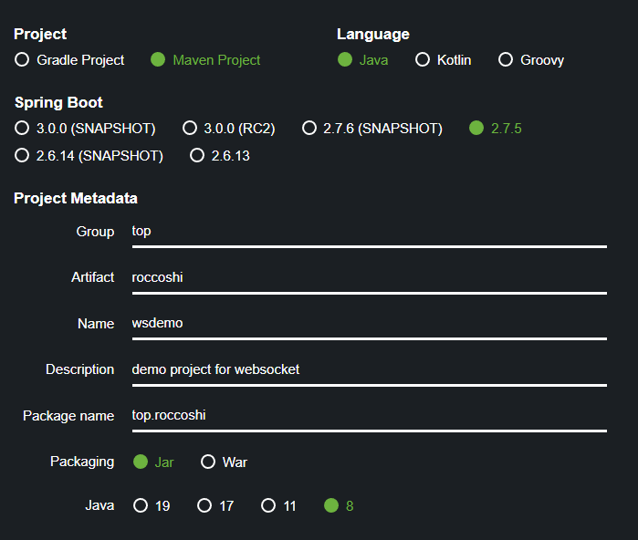

# Websocket Demo

## FrontEnd

`angular`: `9.1.13` 

websocket implementation: `rxjs >= 6`

the main websocket service implementation: [websocket.service.ts](https://github.com/Lincest/websocket-impl/blob/master/frontend/websocket/src/app/websocket.service.ts)

### feature

- [x] Realtime Status
- [x] Auto Reconnect

## BackEnd

host: `ws://localhost:8080`

`go 1.17`: use [gorilla/websocket](https://github.com/gorilla/websocket) with [example](https://github.com/gorilla/websocket/blob/master/examples/echo/server.go)

`java8`: use `springboot` configuration: 

## Example

