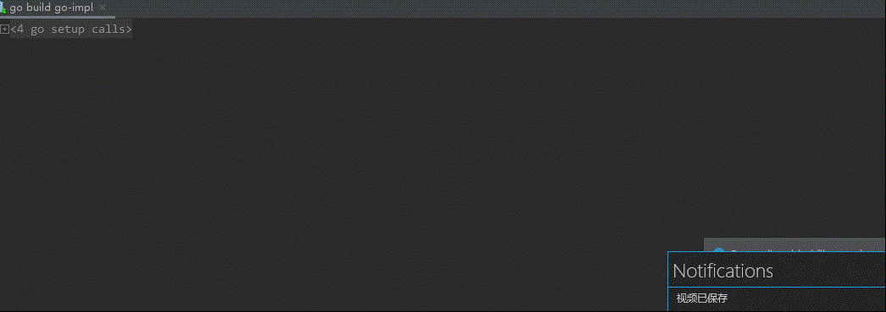

# Websocket Demo

## FrontEnd

`angular`: `9.1.13`

## BackEnd

host: `ws://localhost:8080`

`go 1.17`: use [gorilla/websocket](https://github.com/gorilla/websocket) with [example](https://github.com/gorilla/websocket/blob/master/examples/echo/server.go)

`java8`

## Example

